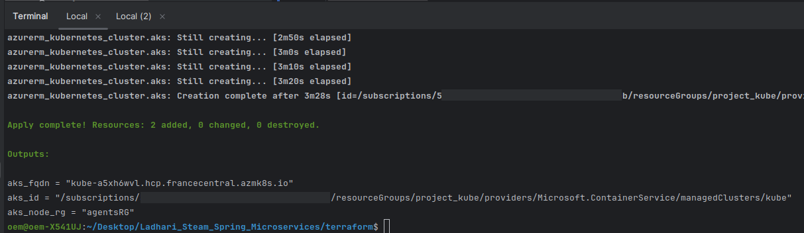
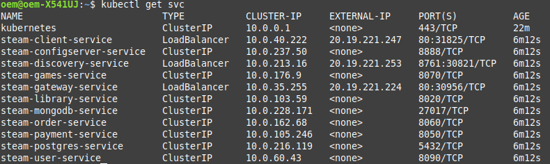
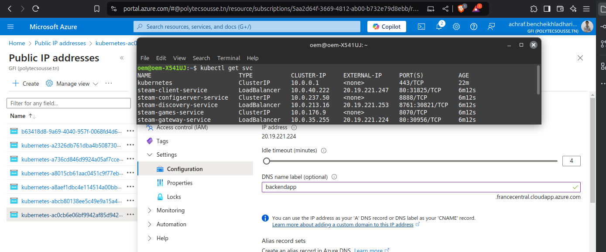
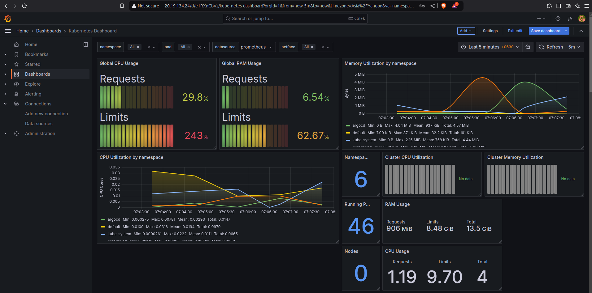

# LADHARI Steam - Spring Boot Microservices

## Description

This project is a microservices-based architecture built using Spring Boot, inspired by platforms like Steam. Its primary goal is to provide users with a platform to browse and purchase games. The architecture is designed for scalability, modularity, and ease of maintenance.

---

## Architectures

### Overview
This platform provides an intuitive way for users to manage their game library, order games, and handle payments. The system is built around key entities and interactions that ensure seamless user experiences.

---

### Features
- **User Registration**: Automatically creates a library for every registered user.
- **Game Library**: Each user has exactly one library, containing all purchased games.
- **Game Ordering**: Users can order multiple games, and the system ensures no duplicate purchases.
- **Payment Processing**: Links payments to orders, with one payment per order.
- **Duplicate Game Check**: Prevents users from purchasing the same game twice.

---

### System Workflow

#### 1. User Registration
- When a user registers on the platform, a library is automatically created for them.
- Each user has only one library associated with their account.

#### 2. Ordering Games
- Users can order one or multiple games.
- The system validates the order:
  - Checks if any of the games in the order already exist in the user's library.
  - If the user already owns a game, the order is canceled, and a message is displayed: "You already own this game."
- If all games in the order are valid, the system creates an order and corresponding order lines.

#### 3. Payment
- Each order generates a single payment entry.
- The system ensures that payment is processed successfully before completing the order.

#### 4. Updating the Library
- Once the payment is confirmed, the games in the order are added to the user's library.
- The library is updated to include the new games.

---

### System Entities

#### User-Service
- **Purpose**: Manages user accounts and registration.
- **Key Action**: Automatically creates a library for each new user.

#### Library-Service
- **Purpose**: Manages the user's game collection.
- **Key Actions**:
  - Automatically creates a library during registration.
  - Updates the library after successful orders.
  - Prevents duplicate games from being added.

#### Orders-Service
- **Purpose**: Manages orders and order lines.
- **Key Actions**:
  - Creates orders and corresponding order lines.
  - Validates that the user does not already own the games being ordered.

#### Payment-Service
- **Purpose**: Handles payments for orders.
- **Key Actions**:
  - Links each payment to a single order.
  - Ensures payments are successful before completing orders.

#### Games-Service
- **Purpose**: Provides details about available games.
- **Key Actions**:
  - Supplies game information to other services.

---

### Key Business Rules
1. **Library Creation**: Each user has exactly one library created during registration.
2. **Order Validation**:
   - An order cannot include games already in the user's library.
   - If a duplicate game is detected, the order is canceled, and the user is notified.
3. **Payment Linking**:
   - Each order is associated with one payment.
   - Orders are only completed after successful payment.
4. **Library Updates**:
   - Upon successful payment, the games in the order are added to the user's library.

---

### Error Handling
- **Duplicate Game in Order**:
  - If the user attempts to order a game already in their library, the order is canceled.
  - A message is displayed: "You already own this game."

### Architecture Diagram


### Infrastructure Diagram


### Class Diagram


### Authentication and Authorization Flow

This document describes the authentication and authorization flow in a microservices architecture using an API Gateway. The flow ensures secure communication, proper validation of user credentials, and controlled access to microservices.

#### Flow Steps

1. **Login Request**:  
   The user sends a login request to the User Service, which processes the login and generates a JWT.

2. **API Gateway Validation**:  
   For all subsequent requests, the Front End includes the JWT in the authorization header. The API Gateway validates the JWT for authentication and authorization.

3. **JWT Validation**:  
   If the JWT is valid, the API Gateway forwards the request to the intended service. If invalid, a 401 Unauthorized response is returned.

4. **Request Forwarding**:  
   Upon successful JWT validation, the API Gateway forwards the request to the appropriate service for processing.

#### Summary

This flow is essential for ensuring secure access to microservices. It ensures that only authorized users can access services, and any invalid JWTs result in an appropriate error response.


---

## Installation

Follow the instructions below to set up the project locally.

### Prerequisites

Make sure you have the following tools installed:

- **Java JDK 17** or later
- **Maven**
- **Docker** and **Docker Compose**
- **PostgreSQL**
- **MongoDB**
- **Angular CLI** (if working with the frontend)

### Steps

1. Clone the repository:

   ```bash
   git clone https://github.com/achrafladhari/UI_Spring
   cd UI_Spring
   ```

2. Build the Spring Boot microservices:

   ```bash
   cd <service-folder>
   mvn clean install
   ```

3. Start the required databases (MongoDB, PostgreSQL) using Docker Compose:

   ```bash
   docker-compose up -d
   ```

   This will start MongoDB and Mongo Express in Docker containers.

4. Run each microservice:

   ```bash
   cd <service-folder>
   mvn spring-boot:run
   ```

5. Example run the API Gateway:

   ```bash
   cd gateway
   mvn spring-boot:run
   ```

6. Run the Angular frontend (if applicable):

   ```bash
   cd UI_Spring
   npm install --force
   ng s
   ```

---

## Usage

### Authentication

All secured routes require a valid JWT token. Obtain the token by authenticating with the `/auth/login` endpoint in the `users` service. The token must be included in the `Authorization` header of all requests to secured endpoints.


### Endpoints

| Service            | Method           | Endpoint                                                 | Description                          | Secured |
| ------------------ | ---------------- | -------------------------------------------------------- | ------------------------------------ | ------- |
| **Category**       | POST, GET        | `localhost:8222/api/v1/category/admin`                   | Manage categories                    | Yes     |
|                    | GET, DELETE, PUT | `localhost:8222/api/v1/category/admin/{category-id}`     | Perform actions on specific category | Yes     |
| **Games**          | POST             | `localhost:8222/api/v1/game/admin`                       | Add a new game                       | Yes     |
|                    | POST             | `localhost:8222/api/v1/games/purchase`                   | Purchase a game                      | Yes     |
|                    | DELETE, PUT      | `localhost:8222/api/v1/game/admin/{game-id}`             | Manage a specific game               | Yes     |
|                    | GET              | `localhost:8222/api/v1/game/pagination`                  | Get paginated list of games          | No      |
|                    | GET              | `localhost:8222/api/v1/game/{game-id}`                   | Get game details                     | No      |
| **Library**        | GET, POST        | `localhost:8222/api/v1/library`                          | Access or modify the library         | Yes     |
|                    | DELETE           | `localhost:8222/api/v1/library/{username}`               | Delete a library by username         | Yes     |
|                    | PUT              | `localhost:8222/api/v1/library/purchase`                 | Update library with a purchase       | Yes     |
| **Orders**         | POST             | `localhost:8222/api/v1/orders`                           | Place an order                       | Yes     |
|                    | GET              | `localhost:8222/api/v1/orders/{username}`                | Get orders for a user                | Yes     |
| **Orders (Admin)** | GET              | `localhost:8222/api/v1/order/admin/{order-id}`           | Get specific order details (admin)   | Yes     |
|                    | GET              | `localhost:8222/api/v1/order/admin`                      | Get all orders (admin)               | Yes     |
| **Order Lines**    | GET              | `localhost:8222/api/v1/order-lines/order/{order-id}`     | Get order lines by order ID          | Yes     |
| **User Service**   | POST             | `localhost:8222/api/v1/auth/login`                       | Authenticate user                    | No      |
|                    | POST             | `localhost:8222/api/v1/auth/register`                    | Register a new user                  | No      |
|                    | GET              | `localhost:8222/api/v1/user/admin/exists/{user-id}`      | Check if user exists                 | Yes     |
|                    | GET              | `localhost:8222/api/v1/user/admin`                       | Get all users (admin)                | Yes     |
|                    | GET              | `localhost:8222/api/v1/user/admin/pagination`            | Get paginated list of users          | Yes     |
|                    | PUT              | `localhost:8222/api/v1/users/update/{user-id}`           | Update user details by ID            | Yes     |
|                    | PUT              | `localhost:8222/api/v1/users/update/username/{username}` | Update user details by username      | Yes     |
|                    | DELETE           | `localhost:8222/api/v1/users/{user-id}`                  | Delete user by ID                    | Yes     |
|                    | GET              | `localhost:8222/api/v1/users/{user-id}`                  | Get user details by ID               | Yes     |
|                    | GET              | `localhost:8222/api/v1/users/username/{user-id}`         | Get user details by username         | Yes     |

### SWAGGER TABLE

The table provides a concise overview of available Swagger endpoints for various services within a system. Each row lists a service name, the HTTP method (all being "SWAGGER" in this case), the specific endpoint URL, and whether the endpoint is secured. None of the endpoints are secured, as indicated in the "Secured" column. These endpoints correspond to the local environment, with URLs pointing to Swagger UI interfaces for managing Users, Games, Library, Orders, and Payments.

| Swager Service Name | Method  | Endpoint                                         | Secured |
| ------------------- | --------| ------------------------------------------------ | ------- |
| **SWGGER USER**     | SWAGGER | `localhost:8222/users/swagger-ui/index.html`     | NO      |
| **SWGGER Games**    | SWAGGER | `localhost:8222/games/swagger-ui/index.html`     | NO      |
| **SWGGER Library**  | SWAGGER | `localhost:8222/library/swagger-ui/index.html`   | NO      |
| **SWGGER Orders**   | SWAGGER | `localhost:8222/order/swagger-ui/index.html`     | NO      |
| **SWGGER Payments** | SWAGGER | `localhost:8222/payment/swagger-ui/index.html`   | NO      |


---

# Docker And Docker Compose
### Docker file for spring boot

### Docker file for Angular


## Prerequisites

- [Docker](https://docs.docker.com/get-docker/)
- [Docker Compose](https://docs.docker.com/compose/install/)

## Running the Application

```
docker-compose up -d
```
-  Access the application at:
    - API Gateway: http://localhost:8222
    - Eureka Dashboard: http://localhost:8761
## Stopping the Application

```
docker-compose down
```
## Docker compose file
### 1. **Config Server**
- **Port**: 8888
- **Description**: Centralized configuration management service.
- **Health Check**: Checks for availability on port 8888.

### 2. **Discovery Service (Eureka)**
- **Port**: 8761
- **Description**: Service registry to allow microservices to discover each other.
- **Depends On**: Config Server (healthcheck).

### 3. **Jenkins**
- **Ports**: 8010 (UI), 50000 (Agent communication)
- **Description**: CI/CD server for automating the build and deployment pipeline.
- **Privileged**: Runs with Docker in Docker for building images.

### 4. **API Gateway**
- **Port**: 8222
- **Description**: Gateway for routing requests to microservices.
- **Depends On**: Discovery Service (healthcheck).

### 5. **Games Service**
- **Description**: Handles game-related data.
- **Database**: PostgreSQL (connection URL).
- **Depends On**: API Gateway (healthcheck).

### 6. **Library Service**
- **Description**: Manages the game library.
- **Database**: MongoDB.
- **Depends On**: API Gateway (healthcheck).

### 7. **Order Service**
- **Description**: Handles game orders.
- **Depends On**: API Gateway (healthcheck).

### 8. **Payment Service**
- **Description**: Manages payment processing for orders.
- **Depends On**: API Gateway (healthcheck).

### 9. **User Service**
- **Description**: Manages user data.
- **Database**: MongoDB.
- **Depends On**: API Gateway (healthcheck).

### 10. **Client (UI)**
- **Port**: 80
- **Description**: Frontend UI for interacting with the microservices.
- **Depends On**: User Service.

### 11. **SonarQube**
- **Port**: 9000
- **Description**: Code quality analysis platform.
- **Database**: PostgreSQL (connection URL).

### 12. **MongoDB**
- **Port**: 27017
- **Description**: NoSQL database for services like Library and User.
- **Environment Variables**: Mongo root username and password.

### 13. **Mongo Express**
- **Port**: 8081
- **Description**: Web-based admin interface for MongoDB.
- **Depends On**: MongoDB.

### 14. **PostgreSQL**
- **Port**: 5432
- **Description**: Relational database for services like Games and Orders.
- **Environment Variables**: PostgreSQL username and password.

### 15. **pgAdmin**
- **Port**: 5050
- **Description**: Web-based admin interface for PostgreSQL.
- **Depends On**: PostgreSQL.

### Health Checks

All services have health checks configured to ensure they are running properly. For example:

- **Config Server**: Available on port 8888.
- **Discovery Service (Eureka)**: Available on port 8761.
- **API Gateway**: Available on port 8222.

If any service fails the health check, Docker Compose will attempt to restart the service.

### Volumes

The following volumes are used to persist data across service restarts:

- `mongo`: MongoDB data.
- `postgres`: PostgreSQL data.
- `pgadmin`: pgAdmin data.
- `sonarqube_data`: SonarQube data.
- `sonarqube_extensions`: SonarQube extensions.
- `sonarqube_logs`: SonarQube logs.

### Networks

All services are connected to the `microservices` network, ensuring they can communicate with each other without exposing services externally unless specified.
### Docker compose file

### Docker Compose Services

### Docker Compose Network & Volumes

## Application Test in local
### Admin
#### CRUD Category

#### CRUD Games

#### CRUD Users

### User
#### Market test local

#### Inventory list

#### Order list

#### 404 Page


---

Got it! Here’s a complete `README` style document for the entire process, including all the steps with the appropriate Docker commands and configuration instructions.

---

# Jenkins

## Step 1: Install Jenkins in Docker

### Prerequisites

- Ensure Docker is installed and running on your system.

### Docker Command to Install Jenkins

Run the following command to start Jenkins in Docker:

```bash
docker run \
  --name jenkins \
  -d \
  -p 8010:8080 \
  -p 50000:50000 \
  --privileged \
  -v jenkins_home:/var/jenkins_home \
  -v /var/run/docker.sock:/var/run/docker.sock \
  -v /usr/bin/docker:/usr/bin/docker \
  --network microservices \
  salahgo/jenkins:dind
```

### Explanation:
- `--name jenkins`: Assigns the container name "jenkins".
- `-d`: Runs the container in detached mode.
- `-p 8010:8080`: Maps port 8080 in the container to port 8010 on the host, allowing you to access Jenkins at `http://localhost:8010`.
- `-p 50000:50000`: Exposes the port used for Jenkins agent communication.
- `--privileged`: Grants the container additional privileges required for Docker in Docker.
- `-v jenkins_home:/var/jenkins_home`: Persists Jenkins data on the host machine.
- `-v /var/run/docker.sock:/var/run/docker.sock`: Allows Jenkins to interact with Docker on the host.
- `-v /usr/bin/docker:/usr/bin/docker`: Ensures Docker is available inside the Jenkins container.
- `--network microservices`: Connects Jenkins to the `microservices` Docker network.

## Step 2: Configure Jenkins

Once Jenkins is running, access it through your browser at `http://localhost:8010`.

### Configure Credentials for GitHub

1. **Access Jenkins Container**:
   ```bash
   docker exec -it jenkins bash
   ```

2. **Generate SSH Key for GitHub**:
   Inside the Jenkins container, generate an SSH key to authenticate with GitHub:
   ```bash
   ssh-keygen -t rsa -b 4096 -C "achrefbenechikh.eladhari@isitc.u-sousse.tn"
   ```

3. **Display the Public Key**:
   Retrieve the generated SSH public key:
   ```bash
   cat ~/.ssh/id_rsa.pub
   ```

4. **Add the SSH Key to GitHub**:
    - Log in to your GitHub account.
    - Go to **Settings** > **SSH and GPG keys** > **New SSH key**.
    - Paste the public key generated in the previous step.

5. **Configure Git Settings**:
   Set your global Git configuration for Jenkins:
   ```bash
   git config --global user.name "Achraf Ladhari"
   git config --global user.email "achrefbenechikh.eladhari@isitc.u-sousse.tn"
   ```

6. **Add GitLab to Known Hosts (jenkins container)**:
   ```bash
   ssh-keyscan gitlab.com >> ~/.ssh/known_hosts
   ```

7. **Test SSH Authentication (jenkins container)**:
   Verify SSH authentication with GitHub:
   ```bash
   ssh -T git@github.com 
   ```
   or with gitlab 
    ```bash
    ssh -T git@gitlab.com
    ```
   You should see:
   ```
   Hi achrafladhari! You've successfully authenticated, but GitHub does not provide shell access.
   ```

### Add GitHub and Docker Hub Credentials in Jenkins

- Navigate to **Manage Jenkins** > **Manage Credentials**.
- Add your GitHub SSH key and Docker Hub credentials for use in the Jenkins pipeline.

## Step 3: Install Required Plugins in Jenkins

### Docker Plugins Installation

1. Go to **Manage Jenkins** > **Manage Plugins**.
2. Install the following plugins:
    - **Docker Commons Plugin**
    - **Docker Pipeline Plugin**

These plugins will allow Jenkins to interact with Docker, build images, and deploy containers.

## Step 4: Create and Configure Jenkins Pipeline

1. **Create a New Pipeline**:
    - In Jenkins, go to **New Item**.
    - Select **Pipeline**, give it a name, and click **OK**.

2. **Define Pipeline Script**:
   In the pipeline configuration, add the following script:

### Pipeline Script Example

```groovy
pipeline {
    agent any
    triggers {
        pollSCM('* * * * *')
    }

    environment {
        DOCKERHUB_CREDENTIALS = credentials('dockerhub')
        IMAGE_NAME_MICROSERVICE_1 = 'docker_hub_username/microservice-1'
        IMAGE_NAME_MICROSERVICE_2 = 'docker_hub_username/microservice-2'
        BUILD_ID = "${env.BUILD_ID}"
    }

    stages {
        stage('Checkout') {
            steps {
                script {
                    checkout([
                            $class: 'GitSCM',
                            branches: [[name: 'branch_contain_code']],
                            userRemoteConfigs: [[
                                                        url: 'ssh_github_url',
                                                        credentialsId: 'id_for_github_in_jenkins'
                                                ]]
                    ])
                }
            }
        }
        stage('Build Microservice 1') {
            when {changset "dir-microservice-1/"}
            steps {
                dir('dir-microservice-1') {
                    script {
                        dockerImageMicroService1 = docker.build("${IMAGE_NAME_MICROSERVICE_1}:${BUILD_ID}")
                    }
                }
            }
        }
        
        stage('Scan Microservice 1 with Trivy') {
            when {changset "dir-microservice-1/"}
            steps {
                script {
                    sh """
                    docker run --rm -v /var/run/docker.sock:/var/run/docker.sock \\
                    -e TRIVY_DB_REPO=ghcr.io/aquasecurity/trivy-db \\
                    aquasec/trivy:latest image --exit-code 0 --scanners vuln --no-progress --timeout 20m --severity LOW,MEDIUM,HIGH,CRITICAL \\
                    ${IMAGE_NAME_MICROSERVICE_1}:${BUILD_ID}
                    """
                }
            }
        }

        stage('Push Microservice 1 to Docker Hub') {
            when {changset "dir-microservice-1/"}
            steps {
                script {
                    docker.withRegistry('https://index.docker.io/v1/', 'docker_hub_cred_id_in_jenkins') {
                        dockerImageMicroService1.push()
                    }
                    sh 'echo "UPDATING TAG IN HELM CHARTS"'
                    withCredentials([sshUserPrivateKey(credentialsId: 'github_cred_in_jenkins', keyFileVariable: 'SSH_KEY')]) {
                        sh """
                                    git clone ssh_github_link temp_repo
                                    cd temp_repo/dir/to/helm/chart
                                    sed -i '/^  tag: / s/: .*/: "${BUILD_ID}"/' values.yaml
                                    git config user.name "Achraf Ladhari"
                                    git config user.email "achrefbenechikh.eladhari@isitc.u-sousse.tn"
                                    git add values.yaml
                                    git commit -m "CustomUpdated tag to ${BUILD_ID} in helm chart"
                                    git push origin master
                                    cd ../../../..
                                    rm -R temp_repo
                                    """
                    }
                }
            }
        }
        //Same steps for every thing
        stage('Build Microservice 2') {
            when {changset "dir-microservice-2/"}
            steps {
                script {
                    // Build microservice 2 (example command)
                    sh 'docker build -t microservice2 .'
                }
            }
        }

        stage('Scan Microservice 2 with Trivy') {
            when {changset "dir-microservice-2/"}
            steps {
                script {
                    // Scan microservice 2 with Trivy
                    sh 'trivy image microservice2'
                }
            }
        }

        stage('Push Microservice 2 to Docker Hub') {
            when {changset "dir-microservice-2/"}
            steps {
                script {
                    // Push the image to Docker Hub
                    sh 'docker push microservice2'
                }
            }
        }
    }
    post {
        always {
            // Clean up environment after pipeline runs
            def imagesToCleanup = [
                    'aquasec/trivy',
                    "${IMAGE_NAME_MICROSERVICE_1}",
                    "${IMAGE_NAME_MICROSERVICE_2}"
            ]
            imagesToCleanup.each { imageName ->
                def imageIds = sh(script: "docker images --filter=reference='${imageName}:*' -q", returnStdout: true).trim()
                if (imageIds) {
                    imageIds.split('\n').each { imageId ->
                        sh "docker rmi -f ${imageId}"
                    }
                }
            }
            def dirExists = fileExists('temp_repo')
            if (dirExists) {
                deleteDir()
            }
            echo 'Cleanup Successfully done!'
        }
    }
}
```
You can find the detailed pipeline in the root folder (Jenkinsfile)
## Step 5: Link Jenkins Pipeline with GitHub Repository

1. **Add Repository URL**:
   In the pipeline configuration, link the Jenkins pipeline to your GitHub repository using the SSH URL.

2. **Configure SCM**:
    - In **Pipeline** section, set the **Definition** to `Pipeline script from SCM`.
    - Select `Git` as the SCM, and provide the SSH URL of your repository.

## Step 6: Run the Pipeline

After configuring everything:

1. **Trigger the Pipeline**:
    - Go to your Jenkins dashboard and select the pipeline you created.
    - Click **Build Now** to run the pipeline.

2. **Monitor Pipeline Execution**:
   The pipeline will:
    - Build the microservices and frontend.
    - Scan each microservice for vulnerabilities using Trivy.
    - Push the Docker images to Docker Hub.
    - Clean up the environment after the pipeline finishes.

Note : My jenkins file has a lot of steps so i can't get screenshot i will put a screen of my docker hub repository.
### Docker hub Repo :

### Jenkins Build Success : 


---

# Deploy AKS Cluster with Terraform

This guide provides step-by-step instructions for deploying an Azure Kubernetes Service (AKS) cluster using Terraform. The AKS cluster will be deployed in a resource group named `project_kube` and the Kubernetes cluster will be named `kube`.

## Prerequisites

Before you start, ensure that you have the following:

- An **Azure subscription**.
- **Terraform** installed on your machine.
- **Azure CLI** installed and configured with access to your Azure subscription.

### Terraform Setup

1. **Install Terraform**:
   Follow the [Terraform installation guide](https://learn.hashicorp.com/tutorials/terraform/install-cli) to install Terraform on your system.

2. **Configure Azure CLI**:
   Run the following command to authenticate with Azure:
   ```bash
   az login
   ```

## Files Overview

### `variables.tf`

This file defines the variables needed for the Terraform configuration. It contains the following variables:

```hcl
variable "subscription" {
  type    = string
  default = "subs_id_from_azure"
}

variable "res" {
  type    = string
  default = "project_kube"
}

variable "location" {
  type    = string
  default = "France Central"
}

variable "cluster_name" {
  type        = string
  default     = "kube"
  description = "AKS name in Azure"
}

variable "kubernetes_version" {
  type        = string
  default     = "1.30.6"
  description = "Kubernetes version"
}

variable "system_node_count" {
  type        = number
  default     = 2
  description = "Number of AKS worker nodes"
}

variable "node_resource_group" {
  type        = string
  default     = "agentsRG"
  description = "Resource Group name for cluster resources in Azure"
}
```

### `main.tf`

This is the main Terraform configuration file that deploys the AKS cluster and the resource group.

```hcl
terraform {
  required_providers {
    azurerm = {
      source = "hashicorp/azurerm"
    }
  }
}

provider "azurerm" {
  features {}
  subscription_id = var.subscription
}

resource "azurerm_resource_group" "rg" {
  name     = var.res
  location = var.location
}

resource "azurerm_kubernetes_cluster" "aks" {
  name                = var.cluster_name
  kubernetes_version  = var.kubernetes_version
  location            = var.location
  resource_group_name = azurerm_resource_group.rg.name
  dns_prefix          = var.cluster_name
  node_resource_group = var.node_resource_group

  default_node_pool {
    name       = "system"
    node_count = var.system_node_count
    vm_size    = "Standard_DS2_v2"
    type       = "VirtualMachineScaleSets"
  }

  identity {
    type = "SystemAssigned"
  }

  network_profile {
    load_balancer_sku = "standard"
    network_plugin    = "kubenet"
  }
}
```

### Outputs

The outputs defined in this configuration will provide key information about the AKS cluster after it is created.

```hcl
output "aks_id" {
  value = azurerm_kubernetes_cluster.aks.id
}

output "aks_fqdn" {
  value = azurerm_kubernetes_cluster.aks.fqdn
}

output "aks_node_rg" {
  value = azurerm_kubernetes_cluster.aks.node_resource_group
}
```

## Steps to Deploy AKS Cluster with Terraform

### 1. Initialize Terraform

Run the following command to initialize your Terraform environment:

```bash
terraform init
```

This command will download the necessary providers and initialize the Terraform workspace.

### 2. Review the Execution Plan

To see what resources Terraform will create, run the following command:

```bash
terraform plan
```

This will output a plan showing the resources that will be created, including the resource group, AKS cluster, and node pool.

### 3. Apply the Configuration

Once you've reviewed the plan, apply the configuration to create the resources:

```bash
terraform apply
```

#### Create AKS with terraform


You will be prompted to confirm the apply. Type `yes` to proceed.

### 4. View the Output

After the resources have been created, Terraform will output key details about the AKS cluster, such as:

- The **ID** of the AKS cluster.
- The **FQDN** (Fully Qualified Domain Name) of the AKS cluster.
- The **Resource Group** used for the cluster's node pool.

Example output:

```bash
Outputs:

aks_id = /subscriptions/subscription_id/resourceGroups/project_kube/providers/Microsoft.ContainerService/managedClusters/kube
aks_fqdn = kube.XXX.azmk8s.io
aks_node_rg = agentsRG
```

### 5. Connect to AKS Cluster

To connect to the AKS cluster and interact with it using `kubectl`, run the following command:

```bash
az aks get-credentials --resource-group project_kube --name kube
```

This command will configure your local Kubernetes configuration to use the newly created AKS cluster.

### 6. Verify the AKS Cluster

Verify that the cluster is up and running by checking the nodes:

```bash
kubectl get nodes
```

You should see a list of nodes in the AKS cluster.

## Cleaning Up

If you want to destroy the resources created by Terraform, run:

```bash
terraform destroy
```

This will remove the AKS cluster and all associated resources.

#### Destroy AKS with terraform


---

# Kubernetes Configuration with Ansible Playbook (AKS)

This guide walks you through deploying ArgoCD, Prometheus, and Grafana in your Kubernetes cluster using an Ansible playbook. It also includes the configuration of the necessary namespaces and services, including the setup of external load balancers.

## Prerequisites

Before running the playbook, ensure you have the following prerequisites:

- **Ansible** installed on your machine.
- **Azure CLI** installed and authenticated with your Azure account.
- **kubectl** installed and configured to interact with your Kubernetes cluster.
- **Helm** installed for package management in Kubernetes.

### Ansible Setup

1. **Install Ansible**:
   Follow the [official Ansible installation guide](https://docs.ansible.com/ansible/latest/installation_guide/index.html) to install Ansible on your system.

2. **Install Helm**:
   Install Helm by following the [Helm installation guide](https://helm.sh/docs/intro/install/).

## Ansible Playbook Overview

### Playbook Structure

This Ansible playbook performs the following tasks:

1. **Configure Kubernetes Cluster Access**: Connects to the AKS cluster using the `az aks get-credentials` command.
2. **Namespace Creation**: Creates the `argocd` and `monitoring` namespaces if they don't already exist.
3. **Install ArgoCD**: Applies the ArgoCD installation YAML to the cluster.
4. **Service Configuration**: Modifies the ArgoCD service from `ClusterIP` to `LoadBalancer` for external access.
5. **Prometheus and Grafana Setup**: Adds Helm repositories, installs Prometheus and Grafana, and configures necessary services with external IP addresses.
6. **Backup and Modify Services**: Backs up the Prometheus and ArgoCD server definitions and modifies them for `LoadBalancer` type.
7. **Wait for External IP**: Waits for external IPs to be assigned to Prometheus and Grafana services.
8. **Retrieve and Print External IPs**: Retrieves and prints the external IPs for ArgoCD, Prometheus, and Grafana servers.

### `monitoring-secrets.yaml`

This file defines the secret for Grafana with the necessary credentials:

```yaml
apiVersion: v1
kind: Secret
metadata:
  namespace: monitoring
  name: grafana-auth
type: Opaque
stringData:
  admin-user: admin
  admin-password: admin
```

### Steps to Execute the Playbook

1. **Clone or Download the Playbook**:
   Download the `playbook.yml` and `monitoring-secrets.yaml` files.

2. **Configure Variables**:
   Modify any variables in the playbook as needed (e.g., change names, passwords).

3. **Run the Playbook**:
   Run the Ansible playbook with the following command:
   ```bash
   ansible-playbook playbook.yml
   ```

4. **Verify the External IPs**:
   After the playbook runs, it will output the external IPs for ArgoCD, Prometheus, and Grafana.

#### Ansible playbook for argoCD


#### Ansible playbook for prometheus and grafana


--- 

# Kubernetes

## **Table of Contents**
1. [Overview](#overview)
2. [Folder Structure](#folder-structure)
3. [Prerequisites](#prerequisites)
4. [Setup Instructions](#setup-instructions)
5. [Kubernetes Resources](#kubernetes-resources)
6. [Configuration Details](#configuration-details)
7. [Monitoring and Logging](#monitoring-and-logging)
8. [Future Improvements](#future-improvements)
9. [Contributing](#contributing)

## **Overview**
This project deploys a cloud-native application with multiple microservices, including:
- **Client (Frontend)**: Angular-based UI.
- **Backend Services**: Microservices for Games, Library, Orders, Payments, and Users.
- **Databases**: PostgreSQL and MongoDB.
- **Config and Discovery Services**: Centralized configuration and service discovery with Eureka and Spring Cloud Config.
- **Gateway**: API Gateway for routing requests.

## **Folder Structure**
```plaintext
kubernetes/
├── app-configmap.yaml          # ConfigMap for shared application settings
├── app-secrets.yaml            # Secrets for sensitive data (e.g., DB credentials)
├── client-deployment.yaml      # Deployment for the frontend
├── client-service.yaml         # Service for the frontend
├── configserver-deployment.yaml # Deployment for the Config Server
├── configserver-service.yaml   # Service for the Config Server
├── discovery-deployment.yaml   # Deployment for Eureka Discovery
├── discovery-service.yaml      # Service for Eureka Discovery
├── <service-name>-deployment.yaml # Deployment for each microservice
├── <service-name>-service.yaml    # Service for each microservice
├── ingress.yaml                # Ingress configuration for external access
└── postgres/mongodb files      # Database deployments and services
```

---

## **Prerequisites**
1. Kubernetes Cluster (e.g., Minikube, AWS EKS, GKE, or AKS).
2. Installed tools:
   - `kubectl`
3. Docker for building container images.
4. Access to a container registry (e.g., Docker Hub).

## **Setup Instructions**

### **Step 1: Apply ConfigMap and Secrets**
Apply shared configurations and secrets:
```bash
kubectl apply -f app-configmap.yaml
kubectl apply -f app-secrets.yaml
```

### **Step 2: Deploy Databases**
Deploy MongoDB and PostgreSQL:
```bash
kubectl apply -f mongodb-deployment.yaml
kubectl apply -f mongodb-service.yaml
kubectl apply -f postgres-deployment.yaml
kubectl apply -f postgres-service.yaml
```

### **Step 3: Deploy Microservices**
Deploy backend and frontend services:
```bash
kubectl apply -f discovery-deployment.yaml
kubectl apply -f discovery-service.yaml
kubectl apply -f configserver-deployment.yaml
kubectl apply -f configserver-service.yaml
kubectl apply -f <service-name>-deployment.yaml
kubectl apply -f <service-name>-service.yaml
```

### **Step 4: Configure Ingress**
Apply ingress configuration for external access:
```bash
kubectl apply -f ingress.yaml
```

### **Step 5: Verify Deployment**
- Check the status of pods:
  ```bash
  kubectl get pods
  ```
- Check services:
  ```bash
  kubectl get svc
  ```

## **Kubernetes Resources**

### **Deployments**
- Define the desired state for each microservice and database.
- Replicas ensure high availability and scalability.

### **Services**
- Expose internal or external access to pods.

### **ConfigMap**
- Shared configuration data for all microservices.

### **Secrets**
- Encoded sensitive data (e.g., database credentials).

### **Ingress**
- External access to the application using a single entry point.

## **Configuration Details**
### **ConfigMap (app-configmap.yaml)**
Centralized configuration for all microservices, including:
- Service URLs.
- Database connection strings.
- Eureka and Gateway hostnames.

### **Secrets (app-secrets.yaml)**
Sensitive data stored securely using base64 encoding:
- MongoDB and PostgreSQL credentials.

## **Monitoring and Logging**
- Include monitoring setup (if applicable):
   - **Prometheus** and **Grafana** for metrics visualization.
- Ensure `monitoring.txt` outlines future steps or configurations.

---


# **Helm Charts for STEAM LADHARI Microservices**

This repository contains Helm charts for deploying the **STEAM LADHARI** application, a microservices-based architecture with multiple components, including backend services, databases, a frontend client, and essential infrastructure services like ConfigServer and Discovery.

## **Table of Contents**
1. [Overview](#overview)
2. [Chart Structure](#chart-structure)
3. [Dependencies and Synchronization](#dependencies-and-synchronization)
4. [Setup Instructions](#setup-instructions)
5. [Values Configuration](#values-configuration)
6. [Secrets Management](#secrets-management)
7. [Helm Commands](#helm-commands)
8. [Future Improvements](#future-improvements)
9. [Contributing](#contributing)

## **Overview**

The Helm charts in this repository facilitate the deployment of the **STEAM LADHARI** application on a Kubernetes cluster. It includes:
- **Microservices**: User, Library, Games, Orders, Payments, Gateway.
- **Databases**: PostgreSQL and MongoDB.
- **Infrastructure Services**: ConfigServer and Discovery.
- **Client Application**: Angular frontend.

The deployment leverages **Helm hooks** and synchronization (`syncWave`) to manage the order of microservices initialization, ensuring seamless service orchestration.

## **Chart Structure**

```plaintext
project_charts/
├── charts/
│   ├── client/
│   │   ├── templates/**
│   │   └── values.yaml      
│   │   └── Chart.yaml          
│   ├── configserver/
│   │   ├── templates/**
│   │   └── values.yaml      
│   │   └── Chart.yaml 
│   ├── discovery/
│   │   ├── templates/**
│   │   └── values.yaml      
│   │   └── Chart.yaml 
│   ├── gateway/
│   │   ├── templates/**
│   │   └── values.yaml      
│   │   └── Chart.yaml 
│   ├── games/
│   │   ├── templates/**
│   │   └── values.yaml      
│   │   └── Chart.yaml 
│   ├── library/
│   │   ├── templates/**
│   │   └── values.yaml      
│   │   └── Chart.yaml 
│   ├── mongodb/
│   │   ├── templates/**
│   │   └── values.yaml   
│   │   └── Chart.yaml
│   ├── order/
│   │   ├── templates/**
│   │   └── values.yaml   
│   │   └── Chart.yaml
│   ├── payment/
│   │   ├── templates/**
│   │   └── values.yaml   
│   │   └── Chart.yaml
│   ├── postgres/
│   │   ├── templates/**       
│   │   └── values.yaml   
│   │   └── Chart.yaml 
│   ├── user/
│   │   ├── templates/**
│   │   └── values.yaml   
│   │   └── Chart.yaml
└── Chart.yaml                # Main Helm chart file with dependencies
```

## **Dependencies and Synchronization**

The charts use **Helm dependencies** to manage individual microservices and databases. The `syncWave` property ensures services are deployed in the correct order:
1. **ConfigServer**: `syncWave: 0`
2. **Discovery**: `syncWave: 1`
3. **Databases (MongoDB, PostgreSQL)**: `syncWave: 2-3`
4. **Other Microservices (User, Library, Games, Orders, Payments)**: `syncWave: 4`
5. **Client**: No `syncWave`, deploys independently.


## **Setup Instructions**

### **Step 1: Install Helm**
Ensure Helm is installed on your local machine:
```bash
helm version
```

### **Step 2: Clone the Repository**
Clone the repository to access the chart files:
```bash
git clone https://github.com/achrafladhari/Ladhari_Steam_Spring_Microservices.git
cd Ladhari_Steam_Spring_Microservices/project_charts
```

### **Step 3: Install Dependencies**
Update dependencies to fetch the subcharts:
```bash
helm dependency update
```

### **Step 4: Deploy the Charts**
Deploy the entire stack with:
```bash
helm install steam . --namespace default --create-namespace
```

## **Values Configuration**

Each chart includes a `values.yaml` file that provides configuration options. Key configurations include:

### **PostgreSQL Values (postgres/values.yaml):**
```yaml
postgresqlUsername: postgres
postgresqlPassword: postgres
postgresqlDatabase: steam
```

### **MongoDB Values (mongodb/values.yaml):**
```yaml
mongodbUsername: achraf
mongodbPassword: ladhari02
```

### **Environment Variables for Microservices:**
Defined in each service's `values.yaml` file and mapped in the deployment templates:
```yaml
env:
  CONFIG_SERVER_URL: "http://configserver-service:8888"
  DISCOVERY_URL: "http://discovery-service:8761/eureka"
  DATABASE_URL: "jdbc:postgresql://postgres-service:5432/steam"
  MONGO_HOST: "mongodb-service"
```

## **Secrets Management**

Sensitive data (e.g., database credentials) is managed through Kubernetes **Secrets**. Secrets are encoded in `base64` format and defined in the respective templates. Example for PostgreSQL:

```yaml
apiVersion: v1
kind: Secret
metadata:
  name: postgres-secret
stringData:
  POSTGRES_USERNAME: cG9zdGdyZXMK  # base64 for 'postgres'
  POSTGRES_PASSWORD: c2VjdXJlcGFzc3dvcmQK  # base64 for 'securepassword'
```

## **Helm Commands**

### **Install Chart**
```bash
helm install steam .
```

### **Upgrade Chart**
```bash
helm upgrade steam .
```

### **Uninstall Chart**
```bash
helm uninstall steam
```

### **Check Release Status**
```bash
helm status steam
```

---

# **Argo CD Setup and Application Deployment**

This document provides step-by-step guidance for setting up **Argo CD** in a Kubernetes cluster using Ansible and deploying an application (`steam`) using GitOps principles.


## **Table of Contents**
1. [Overview](#overview)
2. [Setup Instructions](#setup-instructions)
3. [Argo CD Configuration](#argo-cd-configuration)
4. [Application Deployment](#application-deployment)
5. [Verification and Access](#verification-and-access)
6. [Additional Resources](#additional-resources)

## **Overview**

Argo CD is a declarative, GitOps continuous delivery tool for Kubernetes. It automates the deployment of Kubernetes resources by monitoring Git repositories for changes and syncing them to the cluster.

PS: The setup and configuration phase (argocd) it's done by ansible so check the playbook.

#### Playbook :
```yaml
    - name: Creation of argocd Namespace
      command:  kubectl create ns argocd
      ignore_errors: true

    - name: Apply ARGOCD to cluster
      command: kubectl apply -n argocd -f https://raw.githubusercontent.com/argoproj/argo-cd/stable/manifests/install.yaml
      ignore_errors: true


    - name: Backup current ArgoCD server service definition
      shell: |
         kubectl get service/argocd-server -n argocd -o yaml > /tmp/argocd-server-service.yaml

    - name: Apply loadbalancer instead of clusterIP
      shell: |
         sed -i 's/ClusterIP/LoadBalancer/g' /tmp/argocd-server-service.yaml && \
         kubectl apply -n argocd -f /tmp/argocd-server-service.yaml
      ignore_errors: true

    - name: Wait for external IP to be assigned to ArgoCD server service
      shell: |
         while [ -z "$(kubectl get service argocd-server -n argocd -o jsonpath='{.status.loadBalancer.ingress[0].ip}')" ]; do
           echo "Waiting for LoadBalancer IP..." && sleep 5;
         done

    - name: Get ArgoCD server external IP
      shell: kubectl get service argocd-server -n argocd -o jsonpath='{.status.loadBalancer.ingress[0].ip}'
      register: argocd_server_ip

    - name: Print ArgoCD server external IP
      debug:
         msg: "ArgoCD Server External IP: {{ argocd_server_ip.stdout }}"

    - name: Get ArgoCD initial admin password
      shell: kubectl -n argocd get secret argocd-initial-admin-secret -o jsonpath='{.data.password}' | base64 -d
      register: argocd_admin_password

    - name: Print ArgoCD initial admin password
      debug:
         msg: "ArgoCD Initial Admin Password: {{ argocd_admin_password.stdout }}"
```

This guide covers:
- **Namespace creation** for Argo CD and monitoring.
- **Argo CD installation** using `kubectl`.
- **LoadBalancer configuration** for Argo CD server access.
- **Application deployment** with auto-sync using Argo CD.

## **Setup Instructions**

### **1. Create Namespaces**
Run the following commands to create the required namespaces for Argo CD and monitoring:

```bash
kubectl create ns argocd
kubectl create ns monitoring
```

### **2. Install Argo CD**
Install Argo CD in the `argocd` namespace by applying the official manifests:

```bash
kubectl apply -n argocd -f https://raw.githubusercontent.com/argoproj/argo-cd/stable/manifests/install.yaml
```

### **3. Configure Argo CD Server as LoadBalancer**
To expose the Argo CD server externally:
1. Modify the service type to `LoadBalancer` and apply the changes:
   ```bash
   kubectl edit svc -n argocd argocd-server
   ```

2. Retrieve the external IP:
   ```bash
   kubectl get service argocd-server -n argocd -o jsonpath='{.status.loadBalancer.ingress[0].ip}'
   ```

### **4. Retrieve Initial Admin Password**
Retrieve the initial admin password for the Argo CD server:
```bash
kubectl -n argocd get secret argocd-initial-admin-secret -o jsonpath='{.data.password}' | base64 -d
```

## **Argo CD Configuration**

### **1. Add Git Repository**
1. Log in to the Argo CD server using the external IP and admin credentials retrieved earlier.
2. Add your Git repository using SSH credentials:
   - **Repository URL**: `<your-repo-ssh-url>`
   - **SSH Key**: Upload the private key associated with your repository.

#### ArgoCD adding a repository


### **2. Create an Application**
Define an application in Argo CD using the following settings:
- **Application Name**: `steam`
- **Sync Policy**: Automatic
- **Repository URL**: The Git repository added in the previous step.
- **Path**: `project_chart`
- **Destination**:
   - **Cluster URL**: `https://kubernetes.default.svc`
   - **Namespace**: `default`
- **Sync Options**: Leave default.

#### ArgoCD adding a application


### **3. Sync the Application**
Once the application is created, Argo CD will automatically sync it with your cluster. Monitor the sync status on the Argo CD dashboard.

#### ArgoCD Synchronization


#### ArgoCD Healthy

## **Application Deployment**

The application (`steam`) is deployed from the Helm chart located in the `project_chart` directory of the repository. It includes microservices, databases, and infrastructure components defined in the chart.

Argo CD will:
1. Pull the Helm chart from the Git repository.
2. Deploy resources to the Kubernetes cluster.
3. Monitor the Git repository for changes and automatically apply them.

## **Verification and Access**

1. **Verify Application Status**
   - Open the Argo CD web UI using the external IP.
   - Check the application `steam` for sync status and health.

2. **Access the Application**
   - Retrieve the exposed service endpoints for individual microservices:
     ```bash
     kubectl get svc
     ```

#### Kubernetes services


#### Eureka :


#### Application Access


---
# Assign DNS for gateway service IP and client service IP (Azure)
### **Description: Assign DNS for Gateway and Client Public IP Addresses**

This step involves assigning DNS names to the public IP addresses of the **Gateway** and **Client** services hosted on Azure. By configuring Azure DNS, these services become accessible through user-friendly domain names.

#### **Objective**
- Assign a DNS name to the **Gateway** service's public IP address: `backendapp.francecentral.cloudapp.azure.com`.
- Assign a DNS name to the **Client** service's public IP address: `projectlastyear.francecentral.cloudapp.azure.com`.

#### **Steps to Assign DNS in Azure**

1. **Retrieve Public IP Addresses**:
   - Navigate to the Azure Portal.
   - Locate the **Public IP Address** resources for both the Gateway and Client services.

2. **Configure DNS for Gateway Service**:
   - Select the **Public IP Address** resource assigned to the **Gateway** service.
   - Under **Configuration**, find the **DNS name label** field.
   - Enter `backendapp` (this will resolve to `http://backendapp.francecentral.cloudapp.azure.com/`).
   - Save the changes.
#### DNS Gateway


3. **Configure DNS for Client Service**:
   - Select the **Public IP Address** resource assigned to the **Client** service.
   - Under **Configuration**, find the **DNS name label** field.
   - Enter `projectlastyear` (this will resolve to `http://projectlastyear.francecentral.cloudapp.azure.com/`).
   - Save the changes.

#### DNS Client


4. **Verify DNS Resolution**:
   - Wait for the DNS changes to propagate.
   - Use the `nslookup` or `ping` command to verify the DNS:
     ```bash
     nslookup backendapp.francecentral.cloudapp.azure.com
     nslookup projectlastyear.francecentral.cloudapp.azure.com
     ```
   - Ensure the domain resolves to the correct public IP addresses.
#### Nslookup Client :

#### Nslookup Backend :

5. **Access Services**:
   - Open a browser and navigate to:
      - `http://backendapp.francecentral.cloudapp.azure.com/` for the Gateway service.
      - `http://projectlastyear.francecentral.cloudapp.azure.com/` for the Client service.

#### **Outcome**
- The Gateway service is accessible via `http://backendapp.francecentral.cloudapp.azure.com/`.
- The Client service is accessible via `http://projectlastyear.francecentral.cloudapp.azure.com/`.

---

# Monitoring
### **Monitoring Setup**

This section outlines the steps to set up monitoring for your application using **Prometheus** and **Grafana**. The process involves enabling Prometheus metrics in your application, configuring Prometheus to scrape the metrics, and visualizing them using Grafana dashboards.

#### **Steps to Set Up Monitoring**

1. **Add Prometheus Dependency to Your Application**:
   - Add the following dependency to your `pom.xml` file (for each microservice):
     ```xml
     <dependency>
       <groupId>io.micrometer</groupId>
       <artifactId>micrometer-registry-prometheus</artifactId>
     </dependency>
     ```

2. **Enable Prometheus Metrics in Application Configuration**:
   - Add the following configuration in the `application.yml` file for each microservice:
     ```yaml
     management:
       endpoints:
         web:
           exposure:
             include: health, prometheus
       endpoint:
         health:
           show-details: always
     ```

3. **Update Helm Charts for Prometheus Scraping**:
   - Add the following `podAnnotations` in the `values.yaml` file of your Helm charts:
     ```yaml
     podAnnotations:
       prometheus.io/scrape: "true"
       prometheus.io/port: "8888"  
       prometheus.io/path: "/actuator/prometheus"
     ```
#### Prometheus Annotations :

4. **Verify Prometheus Targets**:
   - After deploying your Helm charts, navigate to the Prometheus web UI.
   - Go to the **Targets** page and ensure your microservices are listed as targets with their metrics being scraped successfully.
#### Prometheus Targets :

5. **Add Data Source in Grafana**:
   - Log in to the Grafana web UI.
   - Navigate to **Configuration** > **Data Sources** and add Prometheus as a data source:
      - URL: `prometheus-server`
#### DataSource Grafana :


6. **Add Dashboards in Grafana**:
   - Import the following dashboards into Grafana to visualize the metrics:
      - **Kubernetes Monitoring Dashboard**:
         - JSON ID: **18283**
         #### Kubernetes Monitoring :
      
      - **JVM Micrometer in Kubernetes Dashboard**:
         - JSON ID: **13788**
         #### Spring Boot Monitoring :
     

#### **Outcome**
- Prometheus scrapes metrics exposed by your microservices.
- Grafana visualizes the collected data with comprehensive dashboards.
- Monitoring is successfully configured for your application.

---

# Test Application in production
#### Home Page :

#### Register Page :

### USER
#### User Account :

#### Game will purchase :

#### Game purchased :

#### Orders Page :

#### Inventory Page :

### ADMIN
#### List Categories :

#### Add Category :

#### Modify Category :

#### Add Game :

#### Modify Game :


**PS** : Same thing for the user there is CRUD with ADMIN privileges and the user can update his profile

---

## Technologies

- [Spring Boot](https://spring.io/) - Backend framework
- [Spring Boot Microservices](https://spring.io/microservices) - Microservices
- [Spring Boot Cloud Gateway](https://spring.io/projects/spring-cloud-gateway) - Gateway
- [Spring Boot Reactive Programming](https://spring.io/reactive) - Reactive programming
- [PostgreSQL](https://www.postgresql.org/) - Relational database
- [MongoDB](https://www.mongodb.com/) - NoSQL database
- [Angular](https://angular.io/) - Frontend framework
- [Feign](https://spring.io/projects/spring-cloud-openfeign) - Declarative REST client
- [Eureka](https://spring.io/projects/spring-cloud-netflix) - Service discovery
- [JWT](https://jwt.io/) - Token-based authentication
- [Docker](https://docs.docker.com/) - Containerisation
- [Jenkins](https://www.jenkins.io/doc/) - Pipeline CI/CD
- [Kubernetes](https://kubernetes.io/docs/home/) - Orchestration
- [Terraform](https://developer.hashicorp.com/terraform/docs) - Build infrastructure
- [Ansible](https://docs.ansible.com/) - Ansible playbooks
- [Helm](https://helm.sh/docs/) - Package Manager for Kubernetes
- [ArgoCD](https://argo-cd.readthedocs.io/en/stable/) - Kubernetes controller
- [Prometheus](https://prometheus.io/docs/introduction/overview/) - Metrics
- [Grafana](https://grafana.com/docs/) - Dashboards
- [Azure](https://learn.microsoft.com/en-us/azure/) - Cloud

---
Achraf BEN CHEIKH LADHARI. © 2024 All rights reserved.