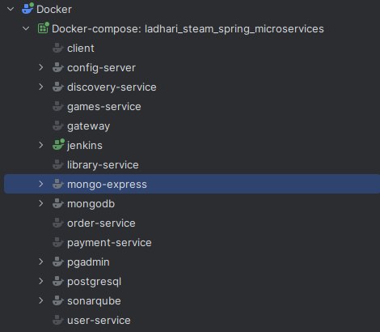

# LADHARI Steam - Spring Boot Microservices

## Description

This project is a microservices-based architecture built using Spring Boot, inspired by platforms like Steam. Its primary goal is to provide users with a platform to browse and purchase games. The architecture is designed for scalability, modularity, and ease of maintenance.

---

## Architectures

### Overview
This platform provides an intuitive way for users to manage their game library, order games, and handle payments. The system is built around key entities and interactions that ensure seamless user experiences.

---

### Features
- **User Registration**: Automatically creates a library for every registered user.
- **Game Library**: Each user has exactly one library, containing all purchased games.
- **Game Ordering**: Users can order multiple games, and the system ensures no duplicate purchases.
- **Payment Processing**: Links payments to orders, with one payment per order.
- **Duplicate Game Check**: Prevents users from purchasing the same game twice.

---

### System Workflow

#### 1. User Registration
- When a user registers on the platform, a library is automatically created for them.
- Each user has only one library associated with their account.

#### 2. Ordering Games
- Users can order one or multiple games.
- The system validates the order:
  - Checks if any of the games in the order already exist in the user's library.
  - If the user already owns a game, the order is canceled, and a message is displayed: "You already own this game."
- If all games in the order are valid, the system creates an order and corresponding order lines.

#### 3. Payment
- Each order generates a single payment entry.
- The system ensures that payment is processed successfully before completing the order.

#### 4. Updating the Library
- Once the payment is confirmed, the games in the order are added to the user's library.
- The library is updated to include the new games.

---

### System Entities

#### User-Service
- **Purpose**: Manages user accounts and registration.
- **Key Action**: Automatically creates a library for each new user.

#### Library-Service
- **Purpose**: Manages the user's game collection.
- **Key Actions**:
  - Automatically creates a library during registration.
  - Updates the library after successful orders.
  - Prevents duplicate games from being added.

#### Orders-Service
- **Purpose**: Manages orders and order lines.
- **Key Actions**:
  - Creates orders and corresponding order lines.
  - Validates that the user does not already own the games being ordered.

#### Payment-Service
- **Purpose**: Handles payments for orders.
- **Key Actions**:
  - Links each payment to a single order.
  - Ensures payments are successful before completing orders.

#### Games-Service
- **Purpose**: Provides details about available games.
- **Key Actions**:
  - Supplies game information to other services.

---

### Key Business Rules
1. **Library Creation**: Each user has exactly one library created during registration.
2. **Order Validation**:
   - An order cannot include games already in the user's library.
   - If a duplicate game is detected, the order is canceled, and the user is notified.
3. **Payment Linking**:
   - Each order is associated with one payment.
   - Orders are only completed after successful payment.
4. **Library Updates**:
   - Upon successful payment, the games in the order are added to the user's library.

---

### Error Handling
- **Duplicate Game in Order**:
  - If the user attempts to order a game already in their library, the order is canceled.
  - A message is displayed: "You already own this game."

### Architecture Diagram


### Class Diagram


### Authentication and Authorization Flow

This document describes the authentication and authorization flow in a microservices architecture using an API Gateway. The flow ensures secure communication, proper validation of user credentials, and controlled access to microservices.

#### Flow Steps

1. **Login Request**:  
   The user sends a login request to the User Service, which processes the login and generates a JWT.

2. **API Gateway Validation**:  
   For all subsequent requests, the Front End includes the JWT in the authorization header. The API Gateway validates the JWT for authentication and authorization.

3. **JWT Validation**:  
   If the JWT is valid, the API Gateway forwards the request to the intended service. If invalid, a 401 Unauthorized response is returned.

4. **Request Forwarding**:  
   Upon successful JWT validation, the API Gateway forwards the request to the appropriate service for processing.

#### Summary

This flow is essential for ensuring secure access to microservices. It ensures that only authorized users can access services, and any invalid JWTs result in an appropriate error response.


---

## Installation

Follow the instructions below to set up the project locally.

### Prerequisites

Make sure you have the following tools installed:

- **Java JDK 17** or later
- **Maven**
- **Docker** and **Docker Compose**
- **PostgreSQL**
- **MongoDB**
- **Angular CLI** (if working with the frontend)

### Steps

1. Clone the repository:

   ```bash
   git clone https://github.com/achrafladhari/UI_Spring
   cd UI_Spring
   ```

2. Build the Spring Boot microservices:

   ```bash
   cd <service-folder>
   mvn clean install
   ```

3. Start the required databases (MongoDB, PostgreSQL) using Docker Compose:

   ```bash
   docker-compose up -d
   ```

   This will start MongoDB and Mongo Express in Docker containers.

4. Run each microservice:

   ```bash
   cd <service-folder>
   mvn spring-boot:run
   ```

5. Example run the API Gateway:

   ```bash
   cd gateway
   mvn spring-boot:run
   ```

6. Run the Angular frontend (if applicable):

   ```bash
   cd UI_Spring
   npm install --force
   ng s
   ```

---

## Usage

### Authentication

All secured routes require a valid JWT token. Obtain the token by authenticating with the `/auth/login` endpoint in the `users` service. The token must be included in the `Authorization` header of all requests to secured endpoints.


### Endpoints

| Service            | Method           | Endpoint                                                 | Description                          | Secured |
| ------------------ | ---------------- | -------------------------------------------------------- | ------------------------------------ | ------- |
| **Category**       | POST, GET        | `localhost:8222/api/v1/category/admin`                   | Manage categories                    | Yes     |
|                    | GET, DELETE, PUT | `localhost:8222/api/v1/category/admin/{category-id}`     | Perform actions on specific category | Yes     |
| **Games**          | POST             | `localhost:8222/api/v1/game/admin`                       | Add a new game                       | Yes     |
|                    | POST             | `localhost:8222/api/v1/games/purchase`                   | Purchase a game                      | Yes     |
|                    | DELETE, PUT      | `localhost:8222/api/v1/game/admin/{game-id}`             | Manage a specific game               | Yes     |
|                    | GET              | `localhost:8222/api/v1/game/pagination`                  | Get paginated list of games          | No      |
|                    | GET              | `localhost:8222/api/v1/game/{game-id}`                   | Get game details                     | No      |
| **Library**        | GET, POST        | `localhost:8222/api/v1/library`                          | Access or modify the library         | Yes     |
|                    | DELETE           | `localhost:8222/api/v1/library/{username}`               | Delete a library by username         | Yes     |
|                    | PUT              | `localhost:8222/api/v1/library/purchase`                 | Update library with a purchase       | Yes     |
| **Orders**         | POST             | `localhost:8222/api/v1/orders`                           | Place an order                       | Yes     |
|                    | GET              | `localhost:8222/api/v1/orders/{username}`                | Get orders for a user                | Yes     |
| **Orders (Admin)** | GET              | `localhost:8222/api/v1/order/admin/{order-id}`           | Get specific order details (admin)   | Yes     |
|                    | GET              | `localhost:8222/api/v1/order/admin`                      | Get all orders (admin)               | Yes     |
| **Order Lines**    | GET              | `localhost:8222/api/v1/order-lines/order/{order-id}`     | Get order lines by order ID          | Yes     |
| **User Service**   | POST             | `localhost:8222/api/v1/auth/login`                       | Authenticate user                    | No      |
|                    | POST             | `localhost:8222/api/v1/auth/register`                    | Register a new user                  | No      |
|                    | GET              | `localhost:8222/api/v1/user/admin/exists/{user-id}`      | Check if user exists                 | Yes     |
|                    | GET              | `localhost:8222/api/v1/user/admin`                       | Get all users (admin)                | Yes     |
|                    | GET              | `localhost:8222/api/v1/user/admin/pagination`            | Get paginated list of users          | Yes     |
|                    | PUT              | `localhost:8222/api/v1/users/update/{user-id}`           | Update user details by ID            | Yes     |
|                    | PUT              | `localhost:8222/api/v1/users/update/username/{username}` | Update user details by username      | Yes     |
|                    | DELETE           | `localhost:8222/api/v1/users/{user-id}`                  | Delete user by ID                    | Yes     |
|                    | GET              | `localhost:8222/api/v1/users/{user-id}`                  | Get user details by ID               | Yes     |
|                    | GET              | `localhost:8222/api/v1/users/username/{user-id}`         | Get user details by username         | Yes     |

### SWAGGER TABLE

The table provides a concise overview of available Swagger endpoints for various services within a system. Each row lists a service name, the HTTP method (all being "SWAGGER" in this case), the specific endpoint URL, and whether the endpoint is secured. None of the endpoints are secured, as indicated in the "Secured" column. These endpoints correspond to the local environment, with URLs pointing to Swagger UI interfaces for managing Users, Games, Library, Orders, and Payments.

| Swager Service Name | Method  | Endpoint                                         | Secured |
| ------------------- | --------| ------------------------------------------------ | ------- |
| **SWGGER USER**     | SWAGGER | `localhost:8222/users/swagger-ui/index.html`     | NO      |
| **SWGGER Games**    | SWAGGER | `localhost:8222/games/swagger-ui/index.html`     | NO      |
| **SWGGER Library**  | SWAGGER | `localhost:8222/library/swagger-ui/index.html`   | NO      |
| **SWGGER Orders**   | SWAGGER | `localhost:8222/order/swagger-ui/index.html`     | NO      |
| **SWGGER Payments** | SWAGGER | `localhost:8222/payment/swagger-ui/index.html`   | NO      |


---


## Technologies

- [Spring Boot](https://spring.io/) - Backend framework
- [Spring Boot Microservices](https://spring.io/microservices) - Microservices
- [Spring Boot Cloud Gateway](https://spring.io/projects/spring-cloud-gateway) - Gateway
- [Spring Boot Reactive Programming](https://spring.io/reactive) - Reactive programming
- [PostgreSQL](https://www.postgresql.org/) - Relational database
- [MongoDB](https://www.mongodb.com/) - NoSQL database
- [Angular](https://angular.io/) - Frontend framework
- [Feign](https://spring.io/projects/spring-cloud-openfeign) - Declarative REST client
- [Eureka](https://spring.io/projects/spring-cloud-netflix) - Service discovery
- [JWT](https://jwt.io/) - Token-based authentication

---

# Docker And Docker Compose
## Prerequisites

- [Docker](https://docs.docker.com/get-docker/)
- [Docker Compose](https://docs.docker.com/compose/install/)

## Running the Application

```
docker-compose up -d
```
-  Access the application at:
    - API Gateway: http://localhost:8222
    - Eureka Dashboard: http://localhost:8761
## Stopping the Application

```
docker-compose down
```
## Docker compose file
### 1. **Config Server**
- **Port**: 8888
- **Description**: Centralized configuration management service.
- **Health Check**: Checks for availability on port 8888.

### 2. **Discovery Service (Eureka)**
- **Port**: 8761
- **Description**: Service registry to allow microservices to discover each other.
- **Depends On**: Config Server (healthcheck).

### 3. **Jenkins**
- **Ports**: 8010 (UI), 50000 (Agent communication)
- **Description**: CI/CD server for automating the build and deployment pipeline.
- **Privileged**: Runs with Docker in Docker for building images.

### 4. **API Gateway**
- **Port**: 8222
- **Description**: Gateway for routing requests to microservices.
- **Depends On**: Discovery Service (healthcheck).

### 5. **Games Service**
- **Description**: Handles game-related data.
- **Database**: PostgreSQL (connection URL).
- **Depends On**: API Gateway (healthcheck).

### 6. **Library Service**
- **Description**: Manages the game library.
- **Database**: MongoDB.
- **Depends On**: API Gateway (healthcheck).

### 7. **Order Service**
- **Description**: Handles game orders.
- **Depends On**: API Gateway (healthcheck).

### 8. **Payment Service**
- **Description**: Manages payment processing for orders.
- **Depends On**: API Gateway (healthcheck).

### 9. **User Service**
- **Description**: Manages user data.
- **Database**: MongoDB.
- **Depends On**: API Gateway (healthcheck).

### 10. **Client (UI)**
- **Port**: 80
- **Description**: Frontend UI for interacting with the microservices.
- **Depends On**: User Service.

### 11. **SonarQube**
- **Port**: 9000
- **Description**: Code quality analysis platform.
- **Database**: PostgreSQL (connection URL).

### 12. **MongoDB**
- **Port**: 27017
- **Description**: NoSQL database for services like Library and User.
- **Environment Variables**: Mongo root username and password.

### 13. **Mongo Express**
- **Port**: 8081
- **Description**: Web-based admin interface for MongoDB.
- **Depends On**: MongoDB.

### 14. **PostgreSQL**
- **Port**: 5432
- **Description**: Relational database for services like Games and Orders.
- **Environment Variables**: PostgreSQL username and password.

### 15. **pgAdmin**
- **Port**: 5050
- **Description**: Web-based admin interface for PostgreSQL.
- **Depends On**: PostgreSQL.

### Health Checks

All services have health checks configured to ensure they are running properly. For example:

- **Config Server**: Available on port 8888.
- **Discovery Service (Eureka)**: Available on port 8761.
- **API Gateway**: Available on port 8222.

If any service fails the health check, Docker Compose will attempt to restart the service.

### Volumes

The following volumes are used to persist data across service restarts:

- `mongo`: MongoDB data.
- `postgres`: PostgreSQL data.
- `pgadmin`: pgAdmin data.
- `sonarqube_data`: SonarQube data.
- `sonarqube_extensions`: SonarQube extensions.
- `sonarqube_logs`: SonarQube logs.

### Networks

All services are connected to the `microservices` network, ensuring they can communicate with each other without exposing services externally unless specified.

## Screens





---

# 
Achraf BEN CHEIKH LADHARI. © 2024 All rights reserved.
